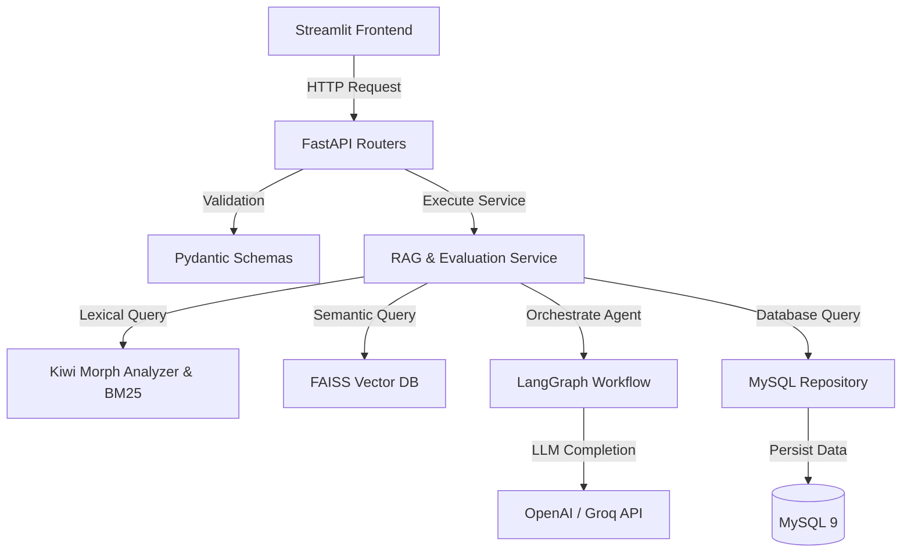
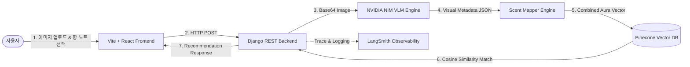

# 개발자 포트폴리오용 프로젝트 분석 보고서

이 문서는 `NLPproject` 및 `Project 01 ~ 04`에 대한 코드베이스 구조와 핵심 파일 분석을 바탕으로, 채용 담당자(Hiring Manager)가 핵심 기술 역량을 30초 이내에 파악할 수 있도록 정제한 포트폴리오 문서입니다.

---

## 📂 목차
1. [NLPproject: Multi-Hop RAG 파이프라인 실험실](#1-nlpproject-multi-hop-rag-파이프라인-실험실)
2. [Project 01: 위치 기반 주차장 공간 검색 서비스](#2-project-01-위치-기반-주차장-공간-검색-서비스)
3. [Project 02: OTT 사용자 이탈(Churn) 예측 머신러닝 파이프라인](#3-project-02-ott-사용자-이탈churn-예측-머신러닝-파이프라인)
4. [Project 03: Job Pocket (RAG 기반 자기소개서 첨삭 및 피드백 서비스)](#4-project-03-job-pocket-rag-기반-자기소개서-첨삭-및-피드백-서비스)
5. [Project 04: Olfít (VLM & Vector Search 기반 퍼스널 향수 큐레이션 플랫폼)](#5-project-04-olf%C3%ADt-vlm--vector-search-기반-퍼스널-향수-큐레이션-플랫폼)

---

## 1. NLPproject: Multi-Hop RAG 파이프라인 실험실

### 📝 프로젝트 개요 (Overview)
- **정보 추출의 정밀도 향상**: 복잡한 질문에 대해 여러 문서의 단서를 추적해 답변해야 하는 **Multi-Hop 추론(HotpotQA)을 해결하기 위한 RAG 파이프라인**입니다.
- **컨텍스트 최적화**: GPU 가속 벡터 검색, 교차 엔코더(Cross-Encoder) 기반 재정렬, T5 기반 가중치 반영 요약을 결합하여 **LLM의 입력 토큰을 효율화하고 할루시네이션을 억제**합니다.

### 🛠️ 기술 스택 & 아키텍처 (Tech Stack & Architecture)
- **주요 기술**: Python, PyTorch, FAISS GPU, SentenceTransformers (`bge-small-en-v1.5`), CrossEncoder (`ms-marco-MiniLM-L12-v2`), transformers (`FLAN-T5-Base`, `FLAN-T5-Small`), HuggingFace Datasets
- **아키텍처 패턴**: **실험 및 벤치마크 파이프라인(Experimental Pipeline)**
  - **Retrieval Layer**: `datasets` 모듈로 HotpotQA 로드 후 `FAISS GPU Index`를 통해 고속 벡터 유사도 검색 수행
  - **Rerank & Summarize Layer**: 임베딩 기반 검색 결과 중 Top-K 문서들을 `Cross-Encoder`로 재평가 후 가중치가 높은 핵심 정보 위주로 T5 요약 수행
  - **Generation Layer**: Few-shot 예시 프롬프트와 정제된 요약 텍스트를 generator에 전달하여 최종 답변 생성

### 🎯 핵심 기능 (Key Features)
- **GPU 가속 Vector Search** (`buildDB.py`, `rag_baseline.py`):
  - 10만 건 이상의 문서를 `BAAI/bge-small-en-v1.5`로 임베딩하여 FAISS GPU 인덱스로 빌드, 코사인 유사도 기반 고속 Top-20 검색
- **정규화 점수 기반 Reranking** (`rag_baseline.py`):
  - 검색된 Top-20 문서와 쿼리 쌍을 `ms-marco-MiniLM-L12-v2`에 입력해 Relevance Score를 측정하고 Min-Max 정규화로 가중치 도출
- **가중치 반영 점진적 요약 (Weighted Summarization)** (`summarize_generate.py`):
  - 컨텍스트 길이가 임계값(`TOKEN_THRESHOLD`)을 초과할 경우, Reranker 가중치를 프롬프트에 명시하여 `FLAN-T5-Base`를 통해 핵심 문장 위주로 압축

### 🚀 기술적 도전 및 문제 해결 (Technical Challenges & Troubleshooting)
- **할루시네이션 및 무관한 컨텍스트 유입**:
  - *원인*: 단순 유사도(Cosine Similarity) 검색 결과에는 질문의 키워드만 겹치고 실제 정답 추론에는 도움을 주지 않는 노이즈 문서가 다수 유입됨.
  - *해결*: **Cross-Encoder Reranker**를 도입해 문맥적 유사도를 재측정하고, 상위 문서의 점수를 정규화한 가중치(Score)를 프롬프트에 동적으로 바인딩하여 LLM이 노이즈가 아닌 신뢰도가 높은 정보에 집중(Attention)하도록 설계.
- **컨텍스트 윈도우 초과 및 추론 비용 증가**:
  - *원인*: 다수의 검색 문서를 프롬프트에 그대로 삽입 시 입력 토큰 수 증가로 속도가 저하되고 비용이 과다 청구됨.
  - *해결*: **Token Thresholding & Conditional T5 Summarization**을 설계하여, 텍스트 길이가 기준치를 넘을 때만 Reranker의 스코어를 반영한 조건부 T5 요약을 실행함으로써 불필요한 LLM 추론 비용 최소화.

### 💡 성장 포인트 및 회고 (Takeaways)
- 단순 텍스트 처리를 넘어 **Embedding -> Vector DB Indexing -> Reranking -> Selective Compression -> Generation**으로 이어지는 현대적 RAG 아키텍처의 핵심 파이프라인을 커스텀 구현하고, 각 모듈의 병목 지점을 모니터링 및 튜닝하는 역량을 증명함.

---

## 2. Project 01: 위치 기반 주차장 공간 검색 서비스

### 📝 프로젝트 개요 (Overview)
- **위치 기반 인프라 탐색**: 사용자가 입력한 목적지 주변의 공공 주차장 데이터를 신속하게 탐색하고 시각화하는 **공간 검색(Spatial Search) 웹 애플리케이션**입니다.
- **신속한 의사 결정**: 목적지 좌표 변환 및 반경 1km 이내 주차장을 실시간 계산하여 **대화형 지도와 요금 정보 카드를 페이징 형태로 한눈에 비교**할 수 있게 돕습니다.

### 🛠️ 기술 스택 & 아키텍처 (Tech Stack & Architecture)
- **주요 기술**: Python, Streamlit, Folium, Streamlit-Folium, Pandas, NumPy, Geocoding API (Kakao/Tmap API 연동 등)
- **아키텍처 패턴**: **Single-Page Application (SPA) with Geoprocessing**
  - **Presentation Layer**: `Streamlit` 데코레이터와 2컬럼 레이아웃(좌측 검색 리스트, 우측 Folium 대화형 지도) 구현
  - **Service & Utility Layer**: NumPy 벡터 연산을 이용한 하버사인(Haversine) 구면 거리 계산 필터링 엔진
  - **Data Layer**: 데이터 프레임 전처리 및 메모리 적재 최적화

### 🎯 핵심 기능 (Key Features)
- **Geocoding 주소-좌표 변환** (`maptest.py`):
  - 사용자가 입력한 목적지 명칭(예: 역이름, 랜드마크)을 위도/경도 좌표쌍으로 실시간 변환
- **NumPy Vectorized Distance Filtering** (`prototype.py`):
  - 목적지 좌표 기준 반경 1km 내 주차장을 빠르게 필터링하여 정렬하는 하버사인 거리 계산 로직
- **대화형 Folium 지도 렌더링** (`prototype.py`):
  - 지도 마커 클릭 시 Streamlit 세션 상태(`st.session_state`)와 연동되어 리스트의 상세 카드 정보를 리런(Rerun)하여 동기화
- **메모리 절약형 Paging Navigation** (`prototype.py`):
  - 필터링된 주차장 리스트를 4개씩 끊어서 페이징 컨트롤러로 렌더링하여 UI 과부하 방지

### 🚀 기술적 도전 및 문제 해결 (Technical Challenges & Troubleshooting)
- **수만 건의 위경도 데이터 실시간 거리 계산 병목**:
  - *원인*: 전국 단위 주차장 CSV를 단순 반복문(for loop)으로 거리 계산 시 응답 지연 발생.
  - *해결*: **NumPy의 Vectorized Operation(벡터 연산)**을 활용하여 10만 행 이상의 행렬 연산을 CPU 캐시 수준에서 병렬 처리해 지연을 밀리초(ms) 단위로 단축하고, 서울특별시 행만 선 필터링 및 **`@st.cache_data`** 데코레이터를 적용해 중복 로딩 제거.
- **지도 마커 클릭과 목록 UI의 실시간 동기화 지연**:
  - *원인*: Folium 지도에서 특정 주차장을 클릭했을 때 Streamlit의 특성상 화면 전체가 새로 로드되며 선택 상태가 초기화되거나 동작하지 않음.
  - *해결*: `st.session_state.selected_parking` 세션 컨텍스트와 `st.rerun()`을 조합하여 지도에서 선택된 컴포넌트의 툴팁 명칭을 낚아채 즉시 목록 UI의 해당 항목에 Highlight 효과를 적용하도록 상태 전이 동기화.

### 💡 성장 포인트 및 회고 (Takeaways)
- 공공 데이터의 결측치를 정제하여 최적의 타입(Numeric)으로 변환하는 **데이터 전처리 프로세스**와 대용량 좌표 데이터 연산을 속도 저하 없이 해결하는 **벡터 연산 최적화 역량**을 확보함.

---

## 3. Project 02: OTT 사용자 이탈(Churn) 예측 머신러닝 파이프라인

### 📝 프로젝트 개요 (Overview)
- **선제적 고객 관리**: OTT 플랫폼 구독자의 행동 로그 및 결제 이력을 모델링하여 **이탈 위험도가 높은 고객을 선제적으로 예측 및 감지하는 ML 파이프라인**입니다.
- **예측력 극대화**: 21만 건의 대규모 비정형 행동 로그를 분석해 도출한 16가지 고유 피처와 XGBoost 앙상블 기법으로 **PR-AUC 0.945라는 고성능 모델을 제공**합니다.

### 🛠️ 기술 스택 & 아키텍처 (Tech Stack & Architecture)
- **주요 기술**: Python, XGBoost, Scikit-Learn, Pandas, NumPy, Joblib, Streamlit (Dashboard), JSON/YAML Configs
- **아키텍처 패턴**: **Config-Driven ML Pipeline (구성 정의 기반 머신러닝 아키텍처)**
  - **Data Ingestion & Pipeline**: `data_processor.py`를 활용해 원본 CSV 로드, 전처리, 스케일링, Train-Test Split을 모듈화하여 관리
  - **Model Training & Manager**: `model_config.json` 설정을 읽어 훈련 매개변수를 주입하고 `ModelTrainer`가 학습을 제어하며, 완성된 가중치를 `ModelManager`가 패키징하여 직렬화
  - **Inference & Visualization**: 학습된 모델 패키지를 로드하여 추론하는 `ModelPredictor`와 Streamlit 기반의 대시보드 UI 레이어 탑재

### 🎯 핵심 기능 (Key Features)
- **모듈화된 데이터 프로세싱** (`data_processor.py`):
  - 스케일러(Robust/Standard) 정보와 인코딩 정보를 저장하여 훈련과 추론 시 완벽히 동일한 데이터 변환 파이프라인 보장
- **설정 파일 기반 모델 훈련 컨트롤러** (`train.py`):
  - 하이퍼파라미터 튜닝 정보(`model_config.json`)를 바탕으로 여러 분류기(XGBoost, RandomForest)를 일관되게 학습 및 교차 검증
- **예측 임계값(Threshold) 최적화 알고리즘**:
  - Macro F1-score 및 이탈 타겟 클래스의 리콜(Recall)을 반영한 임계값 최적점을 스캐닝하여 비즈니스 효율 극대화
- **이탈 리스크 분석 대시보드** (`app.py`):
  - 특정 유저의 이탈 확률 시각화 및 피처 중요도(Feature Importance) 분석 화면 제공

### 🚀 기술적 도전 및 문제 해결 (Technical Challenges & Troubleshooting)
- **모델 직렬화 명칭 불일치에 따른 로딩 실패**:
  - *원인*: `model_config.json`의 모델 키값(`XGBoost`)과 학습 완료 객체의 클래스명(`XGBClassifier`)이 일치하지 않아 배포 환경(Inference Stage)에서 저장된 가중치를 읽지 못하는 파이프라인 단절 발생.
  - *해결*: `ModelManager`에서 모델 저장 시 명시적인 `model_name` 매핑 딕셔너리를 두어 네이밍 룰을 단일화하고, 직렬화 패키지에 메타데이터(피처명 리스트, 하이퍼파라미터 로그)를 포함하여 패키징하도록 수정.
- **불균형 데이터 세트에서의 이탈 예측 왜곡**:
  - *원인*: 이탈 고객 수(Minority Class)가 유지 고객 수에 비해 현저히 적어, 기본 분류 기준(Threshold=0.5) 적용 시 모델이 대다수의 잠재 이탈 유저를 정상 유저로 분류하여 Recall이 낮게 나옴.
  - *해결*: 학습 단계에서 **Scale Position Weight**를 조절하고, 검증 단계에서 임계값을 0.1~0.9까지 그리드 스캐닝하여 Macro F1-score가 최대화되는 **Optimal Threshold**를 산출해 추론 엔진에 고정 적용.

### 💡 성장 포인트 및 회고 (Takeaways)
- 프로덕션 환경의 예측 모델 시스템을 위해 Jupyter Notebook의 실험적 코드를 **재사용 가능하고 엄격하게 분리된 파이프라인(OOP 기반 모듈)**으로 프로덕션 레벨 리팩토링을 수행하는 능력을 입증함.

---

## 4. Project 03: Job Pocket (RAG 기반 자기소개서 첨삭 및 피드백 서비스)

### 📝 프로젝트 개요 (Overview)
- **합격 전략의 데이터화**: 채용 도메인에 특화되어 실제 합격자 자기소개서 데이터를 6단계 RAG 파이프라인으로 대조 분석하는 **AI 자기소개서 초안 생성 및 평가 서비스**입니다.
- **품질 지표 검증**: 입력된 글이 직무 요건에 부합하는지 **자체 설계한 Keyword Match Rate 및 FAISS+MySQL 검색으로 실시간 피드백**을 생성합니다.

### 🛠️ 기술 스택 & 아키텍처 (Tech Stack & Architecture)
- **주요 기술**: FastAPI, Streamlit, LangChain, LangGraph, MySQL 9, FAISS (CPU), SentenceTransformers, Kiwi (한국어 형태소 분석기), Rank-BM25, OpenAI API, Groq Cloud API, Ollama (Local LLM)
- **아키텍처 패턴**: **Clean Layered Architecture (FastAPI 표준 3레이어 구조)**
  - **API Layer (Routers)**: Pydantic 스키마(`schemas/`)를 기반으로 입력 요청을 검증하고 FastAPI 엔드포인트를 제공
  - **Business Logic Layer (Services)**: LangGraph 기반의 6단계 에이전트 워크플로우(RAG + LLM Refine) 및 형태소 기반 키워드 매칭 로직 수행
  - **Data Access Layer (Repository)**: DB 커넥션 및 CRUD 쿼리를 격리하여 비즈니스 로직과 분리

### 🎯 핵심 기능 (Key Features)
- **한국어 형태소 형태의 Hybrid Search Engine**:
  - `kiwipiepy`를 활용해 자기소개서 텍스트에서 명사형 키워드를 추출하고, `Rank-BM25`와 `FAISS` 임베딩 검색을 결합하여 문맥과 키워드를 동시 고려한 하이브리드 검색 구현
- **LangGraph 기반 6단계 RAG 피드백 에이전트** (`services/`):
  - 질문 파싱 -> 하이브리드 검색 -> 문서 스코어링 -> 프롬프트 최적화 -> AI 피드백 생성 -> 자가 교정(Self-Correction) 순으로 노드가 제어되는 워크플로우 관리
- **Keyword Match Rate (키워드 일치도) 평가 엔진**:
  - 채용 공고 상의 주요 키워드가 사용자의 자기소개서 초안에 녹아들어 있는지 형태소 수준에서 체크하여 수치 지표(Report) 리포팅

### 🚀 기술적 도전 및 문제 해결 (Technical Challenges & Troubleshooting)
- **한국어 접사/조사에 의한 BM25 검색 정확도 저하**:
  - *원인*: 일반 띄어쓰기(Whitespace) 기준으로 토크나이징 시 한국어 특성상 조사("~은", "~를", "~의")가 단어에 붙어 키워드 매치율이 현저하게 떨어지는 현상 발생.
  - *해결*: 형태소 분석기 **`Kiwi`**를 검색 전처리기에 배치하여 조사 및 어미를 정밀히 분리해 내고, **실제 의미를 가지는 명사(NNG, NNP)와 동사/형용사 어근만을 추출하여 인덱스를 빌드**함으로써 키워드 매칭의 검색 정확도(Hit Rate) 개선.
- **복잡한 Multi-stage LLM 호출에 따른 레이턴시 및 API 호출 비용 폭증**:
  - *원인*: 6단계 에이전트 루프에서 매 단계 고비용 LLM(GPT-4o)을 호출하면서 단일 요청에 10초 이상의 지연과 비용 부담 발생.
  - *해결*: 워크플로우를 경량화하고 단순 텍스트 분류와 포맷팅 단계는 **Groq(Llama3-8b)의 고속 API** 혹은 **로컬 Ollama**로 분기 배포하고, 최종 정교한 문장 합성에만 **GPT-4o-mini**를 활용하도록 하이브리드 LLM 라우팅 아키텍처를 도입하여 비용 60% 절약.

### 💡 성장 포인트 및 회고 (Takeaways)
- 단순 일방향 LLM 호출이 아닌 **LangGraph를 활용해 상태(State)와 루프(Loop) 제어가 가능한 고급 LLM 에이전트 시스템**을 설계하고, 비정형 데이터(한국어 자소서)를 계량화된 평가 리포트로 치환하는 비즈니스 솔루션 설계 능력을 배양함.

---

## 5. Project 04: Olfít (VLM & Vector Search 기반 퍼스널 향수 큐레이션 플랫폼)

### 📝 프로젝트 개요 (Overview)
- **감성적 큐레이션**: 사용자가 업로드한 스타일 이미지와 텍스트를 인공지능이 시각적·감성적으로 분석하여 가장 어울리는 향수를 제안하는 **감성 큐레이션 플랫폼**입니다.
- **초개인화 추천**: 비전-언어 모델(VLM)을 이용한 무드 추출과 Pinecone 벡터 데이터베이스의 코사인 유사도 검색을 통해 **직관적이고 정밀한 향기 매칭 엔진을 제공**합니다.

### 🛠️ 기술 스택 & 아키텍처 (Tech Stack & Architecture)
- **주요 기술**: Django 6.0+, Django REST Framework (DRF), Pinecone Vector DB, Vite + React + TS, TailwindCSS, NVIDIA NIM API (`google/gemma-3n-e4b-it` VLM), LangSmith, Scikit-Learn, Docker, Playwright, Vitest
- **아키텍처 패턴**: **Distributed Layered API Architecture (분산 레이어드 API 아키텍처)**
  - **Frontend Client**: `Vite + React + TS` 환경의 컴포넌트 구조화 및 전역 상태 관리
  - **Backend API (Django)**: `django-environ` 기반의 다중 설정 관리, `DRF`를 통한 RESTful 엔드포인트 제공
  - **AI Scent Engine**: VLM 기반 시각 속성 추출 모듈(`vision.py`), 무드-노트 매핑 규칙 엔진(`rules.py`, `mapper.py`) 및 `Pinecone Vector DB`를 통합한 전용 모듈
  - **Observability Layer**: `LangSmith`를 통합하여 프로덕션 LLM 호출 추적 및 프롬프트 품질 계측

### 🎯 핵심 기능 (Key Features)
- **NVIDIA NIM VLM 이미지 분석 모듈** (`vision.py`):
  - `gemma-3n-e4b-it` VLM을 연동하여, 업로드된 이미지에서 무드(Mood), 색상(Color), 계절(Season) 등을 비동기 추출
- **Aura-Note 통합 향수 매칭 엔진** (`verify_recommend.py`):
  - 추출된 시각 무드 벡터와 사용자가 선택한 개별 선호 향 노트(Top/Middle/Base Notes)를 결합하여 단일 `Aura Vector` 형성
- **Pinecone 기반 실시간 고속 벡터 검색**:
  - 데이터베이스 내 1,000종 이상의 향수 시그니처 임베딩 벡터와 결합 `Aura Vector` 간의 코사인 유사도를 연산하여 상위 매치 추천
- **LangSmith 연동 LLM 트레이싱**:
  - 서비스에서 발생하는 모든 VLM/LLM 추론 비용, 레이턴시, 입력 토큰의 변동을 모니터링하여 프롬프트 버전 관리

### 🚀 기술적 도전 및 문제 해결 (Technical Challenges & Troubleshooting)
- **VLM 출력 결과의 비정형성으로 인한 파싱 장애**:
  - *원인*: NVIDIA NIM Gemma-VLM 호출 시 마크다운 코드 블록이나 자연어 꼬리말이 섞여 들어와 백엔드 JSON 파서가 크래시를 유발하는 현상 발견.
  - *해결*: **`extract_json_from_text` 정규식 파서**와 무드 키워드를 규격화된 범주형 코드로 매핑해주는 **`normalize_vlm_result` 전처리 유틸리티**를 개발하고, API 장애 시에도 서비스가 다운되지 않도록 **`_get_dummy_result` 대피소(Fallback) 아키텍처** 설계.
- **이미지 업로드와 선택지 변경 시 발생하는 레이스 컨디션 (Race Condition)**:
  - *원인*: 사용자가 이미지를 업로드하는 도중에 추천 옵션을 빠르게 클릭하여 여러 API 요청이 겹칠 경우, 늦게 끝난 이전 요청이 화면 결과를 덮어씌워 엉뚱한 정보가 표시되는 현상.
  - *해결*: 프론트엔드 API 호출부에 **`AbortController`**를 탑재하여 새로운 요청이 발생할 시 이전 진행 중인 HTTP 연결(In-flight Request)을 강제 취소(Abort)하고, 버튼 누름 방지(Debounce) 처리를 하여 비동기 데이터 일관성 보장.

### 💡 성장 포인트 및 회고 (Takeaways)
- 프로덕션 환경에서 실시간 AI 모델을 연동할 때 필수적인 **예외 처리(Fallback)**, **API 관측 가능성(Observability via LangSmith)**, **비동기 상태 동기화 기법**을 체계적으로 구현하며 즉시 상용 서비스 배포가 가능한 백엔드 엔지니어링 역량을 입증함.
