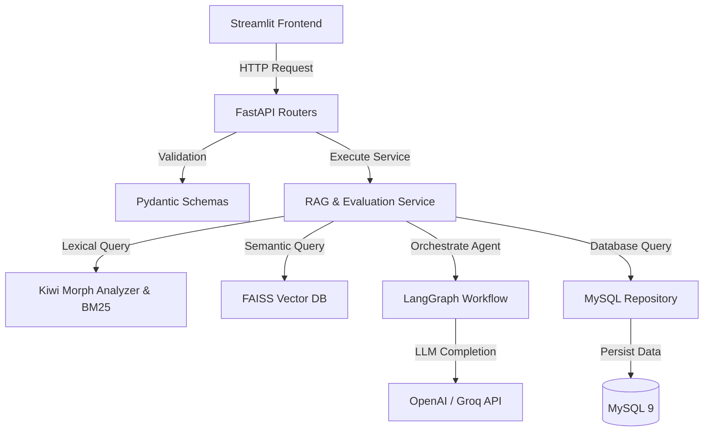

## 📝 프로젝트 개요 (Overview)
- **합격 전략의 데이터화**: 채용 도메인에 특화되어 실제 합격자 자기소개서 데이터를 6단계 RAG 파이프라인으로 대조 분석하는 **AI 자기소개서 초안 생성 및 평가 서비스**입니다.
- **품질 지표 검증**: 입력된 글이 직무 요건에 부합하는지 **자체 설계한 Keyword Match Rate 및 FAISS+MySQL 검색으로 실시간 피드백**을 생성합니다.

## 🛠️ 기술 스택 & 아키텍처 (Tech Stack & Architecture)
- **주요 기술**: FastAPI, Streamlit, LangChain, LangGraph, MySQL 9, FAISS (CPU), SentenceTransformers, Kiwi (한국어 형태소 분석기), Rank-BM25, OpenAI API, Groq Cloud API, Ollama (Local LLM)
- **아키텍처 패턴**: **Clean Layered Architecture (FastAPI 표준 3레이어 구조)**
  - **API Layer (Routers)**: Pydantic 스키마(`schemas/`)를 기반으로 입력 요청을 검증하고 FastAPI 엔드포인트를 제공
  - **Business Logic Layer (Services)**: LangGraph 기반의 6단계 에이전트 워크플로우(RAG + LLM Refine) 및 형태소 기반 키워드 매칭 로직 수행
  - **Data Access Layer (Repository)**: DB 커넥션 및 CRUD 쿼리를 격리하여 비즈니스 로직과 분리

## 🎯 핵심 기능 (Key Features)
- **한국어 형태소 형태의 Hybrid Search Engine**:
  - `kiwipiepy`를 활용해 자기소개서 텍스트에서 명사형 키워드를 추출하고, `Rank-BM25`와 `FAISS` 임베딩 검색을 결합하여 문맥과 키워드를 동시 고려한 하이브리드 검색 구현
- **LangGraph 기반 6단계 RAG 피드백 에이전트** (`services/`):
  - 질문 파싱 -> 하이브리드 검색 -> 문서 스코어링 -> 프롬프트 최적화 -> AI 피드백 생성 -> 자가 교정(Self-Correction) 순으로 노드가 제어되는 워크플로우 관리
- **Keyword Match Rate (키워드 일치도) 평가 엔진**:
  - 채용 공고 상의 주요 키워드가 사용자의 자기소개서 초안에 녹아들어 있는지 형태소 수준에서 체크하여 수치 지표(Report) 리포팅

## 💡 성장 포인트 및 회고 (Takeaways)
- 단순 일방향 LLM 호출이 아닌 **LangGraph를 활용해 상태(State)와 루프(Loop) 제어가 가능한 고급 LLM 에이전트 시스템**을 설계하고, 비정형 데이터(한국어 자소서)를 계량화된 평가 리포트로 치환하는 비즈니스 솔루션 설계 능력을 배양함.

---

### 🔍 관련 문서
- [**Troubleshooting 상세 보기**](troubleshooting/) : 한국어 토큰 형태소 분석기 우회 및 LLM 하이브리드 라우팅 최적화
