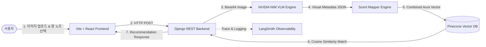

## 📝 프로젝트 개요 (Overview)
- **감성적 큐레이션**: 사용자가 업로드한 스타일 이미지와 텍스트를 인공지능이 시각적·감성적으로 분석하여 가장 어울리는 향수를 제안하는 **감성 큐레이션 플랫폼**입니다.
- **초개인화 추천**: 비전-언어 모델(VLM)을 이용한 무드 추출과 Pinecone 벡터 데이터베이스의 코사인 유사도 검색을 통해 **직관적이고 정밀한 향기 매칭 엔진을 제공**합니다.

## 🛠️ 기술 스택 & 아키텍처 (Tech Stack & Architecture)
- **주요 기술**: Django 6.0+, Django REST Framework (DRF), Pinecone Vector DB, Vite + React + TS, TailwindCSS, NVIDIA NIM API (`google/gemma-3n-e4b-it` VLM), LangSmith, Scikit-Learn, Docker, Playwright, Vitest
- **아키텍처 패턴**: **Distributed Layered API Architecture (분산 레이어드 API 아키텍처)**
  - **Frontend Client**: `Vite + React + TS` 환경의 컴포넌트 구조화 및 전역 상태 관리
  - **Backend API (Django)**: `django-environ` 기반의 다중 설정 관리, `DRF`를 통한 RESTful 엔드포인트 제공
  - **AI Scent Engine**: VLM 기반 시각 속성 추출 모듈(`vision.py`), 무드-노트 매핑 규칙 엔진(`rules.py`, `mapper.py`) 및 `Pinecone Vector DB`를 통합한 전용 모듈
  - **Observability Layer**: `LangSmith`를 통합하여 프로덕션 LLM 호출 추적 및 프롬프트 품질 계측

## 🎯 핵심 기능 (Key Features)
- **NVIDIA NIM VLM 이미지 분석 모듈** (`vision.py`):
  - `gemma-3n-e4b-it` VLM을 연동하여, 업로드된 이미지에서 무드(Mood), 색상(Color), 계절(Season) 등을 비동기 추출
- **Aura-Note 통합 향수 매칭 엔진** (`verify_recommend.py`):
  - 추출된 시각 무드 벡터와 사용자가 선택한 개별 선호 향 노트(Top/Middle/Base Notes)를 결합하여 단일 `Aura Vector` 형성
- **Pinecone 기반 실시간 고속 벡터 검색**:
  - 데이터베이스 내 1,000종 이상의 향수 시그니처 임베딩 벡터와 결합 `Aura Vector` 간의 코사인 유사도를 연산하여 상위 매치 추천
- **LangSmith 연동 LLM 트레이싱**:
  - 서비스에서 발생하는 모든 VLM/LLM 추론 비용, 레이턴시, 입력 토큰의 변동을 모니터링하여 프롬프트 버전 관리

## 💡 성장 포인트 및 회고 (Takeaways)
- 프로덕션 환경에서 실시간 AI 모델을 연동할 때 필수적인 **예외 처리(Fallback)**, **API 관측 가능성(Observability via LangSmith)**, **비동기 상태 동기화 기법**을 체계적으로 구현하며 즉시 상용 서비스 배포가 가능한 백엔드 엔지니어링 역량을 입증함.

---

### 🔍 관련 문서
- [**Troubleshooting 상세 보기**](troubleshooting/) : VLM 비정형 결과 예외 처리 및 UI 비동기 레이스 컨디션 차단
- [**프로젝트 Wiki 상세 보기 (더 보기)**](https://joraemon-s-secret-gadgets.github.io/olfit/) : 아우라 수식 연산 설계, 시맨틱 하이브리드 재정렬 알고리즘 상세 문서
